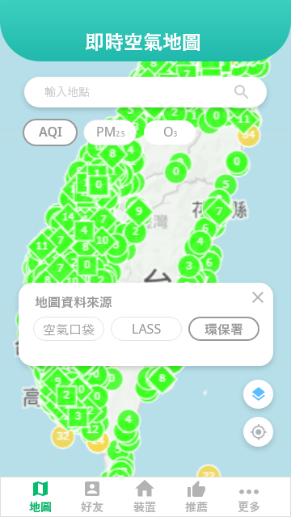
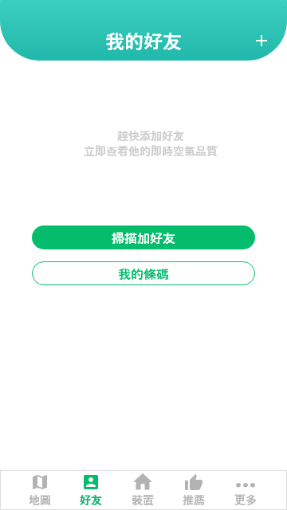

# 🌱 AirPocket - 空氣口袋

[](https://github.com/your-repo)
[](https://github.com/your-repo)
[](https://github.com/your-repo)

> 一個結合 IoT 裝置、Android 應用程式與後端服務的智慧空氣品質監測系統

## 📖 專案簡介


AirPocket（空氣口袋）是一個創新的空氣品質監測平台，透過自製的 IoT 感測器裝置、Android 行動應用程式，以及整合 EPA 和 LASS 開放資料，為使用者提供即時、準確的空氣品質資訊。系統不僅能監測空氣品質，還能推薦適合的旅遊景點，並提供社交功能讓使用者分享資訊。

### 🌟 專案亮點
- **創新整合**：結合 IoT 硬體、行動應用與開放資料
- **智慧推薦**：基於空氣品質的景點推薦系統
- **視覺化設計**：直觀的小樹狀態指示器
- **社交功能**：好友系統與資料分享機制
- **🏆 獲獎認證**：資訊工程學系畢業專題競賽佳作 + 廠商獎

## ✨ 主要特色

### 🎯 核心功能
- **即時空氣品質監測**：整合 EPA 官方測站與 LASS 社群資料
- **IoT 裝置連接**：支援藍牙連接自製空氣品質感測器
- **智慧地圖顯示**：Google Maps 整合，視覺化顯示空氣品質數據
- **景點推薦系統**：基於空氣品質推薦適合的旅遊景點
- **社交功能**：好友系統與資料分享
- **個人化設定**：空汙警報閾值設定

### 🛠 技術架構
- **前端**：Android 原生應用程式 (Java)
- **後端**：Python Flask 伺服器
- **資料庫**：MySQL
- **IoT 裝置**：ESP32 + 空氣品質感測器
- **通訊協定**：Bluetooth、MQTT、HTTP API

## 🏗 系統架構

### 整體架構圖
```
┌─────────────────┐    ┌─────────────────┐    ┌─────────────────┐
│   IoT 裝置      │    │  Android App    │    │  後端伺服器     │
│                 │    │                 │    │                 │
│ • ESP32         │◄──►│ • 地圖顯示      │◄──►│ • Flask API     │
│ • 空氣感測器    │    │ • 裝置連接      │    │ • 資料處理      │
│ • 藍牙通訊      │    │ • 景點推薦      │    │ • 資料庫管理    │
│ • MQTT 傳輸     │    │ • 社交功能      │    │ • 外部 API      │
└─────────────────┘    └─────────────────┘    └─────────────────┘
         │                       │                       │
         └───────────────────────┼───────────────────────┘
                                 │
                    ┌─────────────────┐
                    │  外部資料源     │
                    │                 │
                    │ • EPA 測站資料  │
                    │ • LASS 社群資料 │
                    │ • Google Places │
                    └─────────────────┘
```

### 應用程式架構

*AirPocket 系統架構圖 - 展示各模組間的關係*

### 資料流程圖
```
IoT 感測器 → 藍牙傳輸 → Android App → HTTP API → 後端伺服器
     ↓              ↓           ↓         ↓
  即時數據      裝置連接    地圖顯示   資料處理
     ↓              ↓           ↓         ↓
  MQTT 傳輸    景點推薦    社交功能   資料庫儲存
     ↓              ↓           ↓         ↓
  雲端同步     Google Maps  好友分享   外部 API
```

## 📱 應用程式功能

### 🗺 地圖功能
- **即時空氣品質地圖**：顯示 EPA 和 LASS 測站資料
- **資料來源切換**：支援 EPA 官方資料與 LASS 社群資料
- **空氣品質指標**：PM2.5、AQI 等指標的視覺化顯示
- **測站資訊**：點擊測站查看詳細資料

### 📊 裝置管理
- **藍牙連接**：連接自製空氣品質感測器
- **即時數據**：顯示溫度、濕度、PM2.5 等數據
- **小樹狀態**：根據空氣品質顯示不同顏色的小樹
- **空汙警報**：超過設定閾值時自動提醒

### 🎯 景點推薦
- **智慧推薦**：基於空氣品質推薦適合的旅遊景點
- **景點收藏**：收藏喜愛的景點
- **距離計算**：顯示景點距離與空氣品質
- **Google Maps 整合**：一鍵導航到推薦景點

### 👥 社交功能
- **好友系統**：添加好友並分享資料
- **資料分享**：與好友分享空氣品質資訊
- **個人設定**：自訂空汙警報閾值

## 🔧 技術實作

### Android 應用程式
- **開發語言**：Java
- **最低版本**：Android API 21+
- **主要功能模組**：
  - `MapsActivity`：地圖顯示與測站資料
  - `Device`：裝置連接與數據顯示
  - `Tourism`：景點推薦與收藏
  - `Friend`：社交功能
  - `UserSet`：個人設定

### 後端服務
- **框架**：Python Flask
- **資料庫**：MySQL
- **API 端點**：
  - `/lass`：LASS 社群資料
  - `/epa`：EPA 官方資料
  - `/weather/<location>`：特定位置天氣資料
  - `/google/<location>`：景點推薦

### IoT 裝置
- **微控制器**：ESP32
- **感測器**：DHT22 (溫濕度)、PMS5003 (PM2.5)
- **通訊方式**：Bluetooth、WiFi、MQTT
- **資料格式**：JSON

#### 感測器程式碼範例
```cpp
// 空氣品質感測器讀取
if (pms.read(data)) {
    pmat1 = data.PM_AE_UG_1_0;    // PM1.0
    pmat25 = data.PM_AE_UG_2_5;    // PM2.5
    pmat100 = data.PM_AE_UG_10_0;  // PM10
}

// 溫濕度感測器讀取
h = dht.readHumidity();
t = dht.readTemperature();
```

#### 藍牙通訊範例
```cpp
// 藍牙資料傳輸
String msgStr = "[{";
msgStr += "\"boxID\":\"" + boxID + "\"";
msgStr += ",\"data\":{";
msgStr += "\"temperature\":\"" + String(t) + "\"";
msgStr += ",\"humidity\":\"" + String(h) + "\"";
msgStr += ",\"pm25\":\"" + String(pmat25) + "\"";
msgStr += "}}]";

BT.println(msgStr);
```

## 📊 資料庫設計

### 主要資料表
- **data**：感測器資料記錄
- **user**：使用者資訊
- **friend**：好友關係
- **mycollection**：景點收藏
- **decoration**：裝飾品資訊
- **task**：任務系統

## 🚀 安裝與使用

### 環境需求
- Android 5.0+ 裝置
- Python 3.7+
- MySQL 5.7+
- ESP32 開發板
- 空氣品質感測器

### 安裝步驟

1. **後端服務設定**
   ```bash
   # 安裝 Python 依賴
   pip install flask pymysql requests
   
   # 設定資料庫
   mysql -u root -p < airbox.sql
   
   # 啟動伺服器
   python myServer1204.py
   ```

2. **Android 應用程式**
   ```bash
   # 使用 Android Studio 開啟專案
   # 修改伺服器 IP 位址
   # 編譯並安裝到裝置
   ```

3. **IoT 裝置設定**
   ```cpp
   // 修改 WiFi 設定
   const char* ssid = "YOUR_WIFI_SSID";
   const char* password = "YOUR_WIFI_PASSWORD";
   
   // 上傳程式碼到 ESP32
   ```

## 📸 應用程式截圖

### 🗺 地圖功能

*即時空氣品質地圖 - 顯示 EPA 和 LASS 測站資料*


*地圖縮放功能 - 查看不同區域的空氣品質*


*資料來源切換選單 - 支援 EPA 和 LASS 資料*

### 📱 裝置管理

*裝置連接頁面 - 顯示即時感測器數據*


*小樹狀態指示 - 根據空氣品質變化顏色*


*空汙警報提醒 - 超過設定閾值時自動提醒*

### 🎯 景點推薦

*景點推薦頁面 - 基於空氣品質推薦適合景點*


*景點篩選功能 - 根據空氣品質篩選景點*


*景點收藏管理 - 管理喜愛的景點*

### 👥 社交功能

*好友功能頁面 - 社交互動與資料分享*


*好友添加 - 透過條碼添加好友*


*好友狀態顯示 - 尚未添加好友的狀態*

### ⚙️ 裝置設定

*裝置添加頁面 - 連接 IoT 空氣品質感測器*


*裝置連接成功 - 成功連接感測器裝置*

### 🎨 小樹狀態變化
根據空氣品質的不同，小樹會呈現不同的顏色：


*良好空氣品質 - 綠色小樹*


*普通空氣品質 - 黃色小樹*


*不良空氣品質 - 紅色小樹*


*危險空氣品質 - 紫色小樹*

## 🔮 未來發展

### 計畫功能
- **機器學習預測**：基於歷史資料預測空氣品質
- **更多感測器支援**：擴展感測器種類
- **Web 版本**：開發網頁版介面
- **API 開放**：提供第三方開發者 API

### 技術改進
- **效能優化**：提升應用程式效能
- **安全性增強**：加強資料傳輸安全
- **使用者體驗**：改善介面設計與操作流程

## 🏆 得獎經歷

### 🥉 專題競賽獲獎
- **資訊工程學系畢業專題競賽 - 佳作**
- **廠商獎** - 獲得業界認可

### 🎯 專題評審亮點
- **創新性**：結合 IoT 硬體與行動應用的創新整合
- **實用性**：解決實際空氣品質監測需求
- **技術深度**：展現完整的全端開發能力
- **使用者體驗**：直觀的視覺化介面設計

## 👥 開發團隊

- **專案負責人**：陳松林
- **開發時間**：2021年
- **技術領域**：IoT、Android 開發、後端服務
- **學術成就**：資訊工程學系畢業專題競賽佳作

## 📄 授權

本專案為學術研究用途，請遵守相關使用條款。

## 🤝 貢獻

歡迎提交 Issue 和 Pull Request 來改進這個專案。

---

**AirPocket** - 讓空氣品質監測變得簡單而有趣！ 🌱✨
